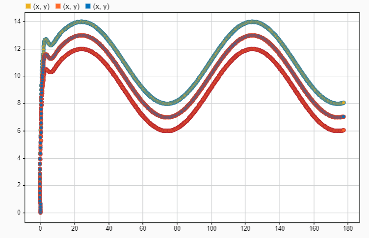
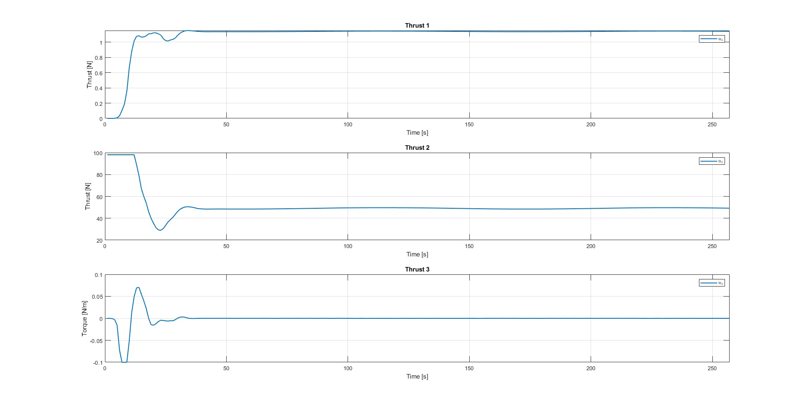
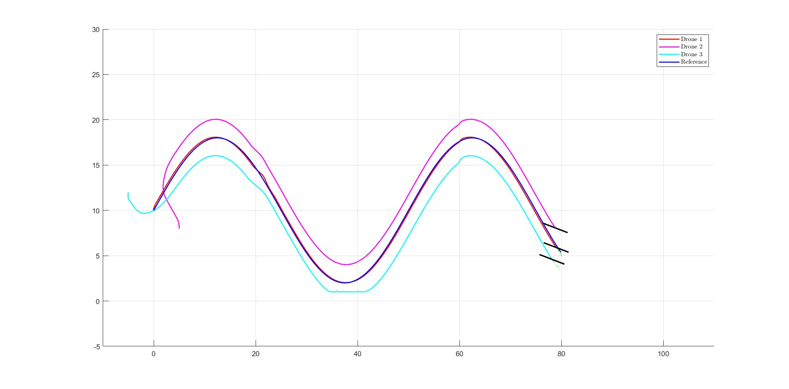
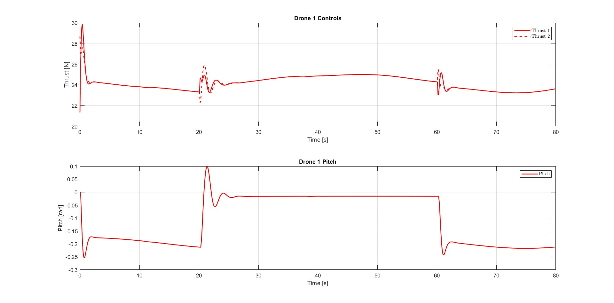
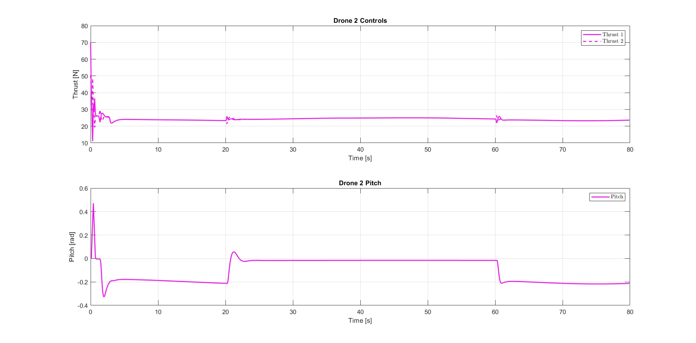
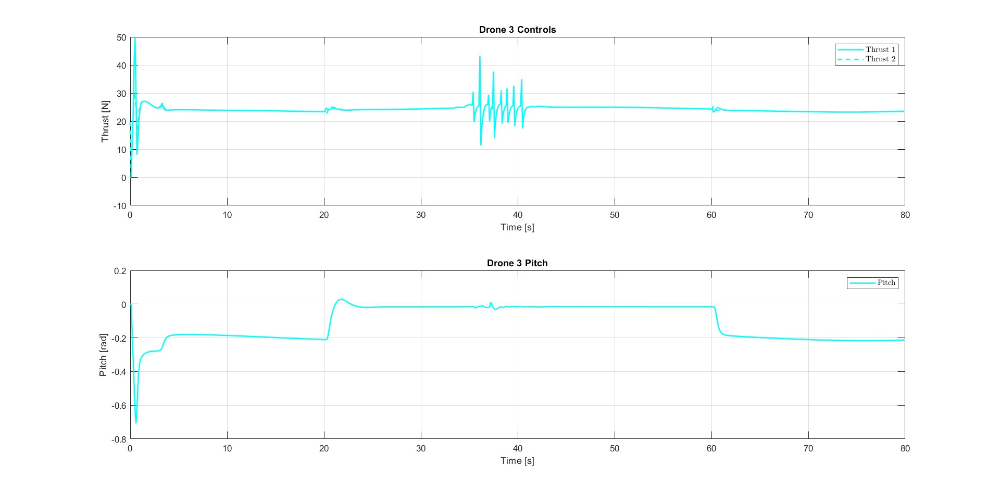

# 🛸 Multi-UAVs Reference Tracking Using MPC

> Final project for the *Model Predictive Control* course at Universitat Politècnica de Catalunya (UPC).
> 
> Author: Marco Alikhani Najafabadi   

This work implements **Linear** and **Non-linear Model Predictive Control** (LMPC & NLMPC) for reference-trajectory tracking with a fleet of three quadrotor UAVs, accounting for collision avoidance, hard input/state constraints, and wind disturbances.

---

## 📚 Table of Contents
1. [Overview](#overview)
2. [System Model](#system-model)
3. [Controllers](#controllers)
4. [Implementation](#implementation)
5. [Results](#results)
6. [Conclusion](#conclusion)
7. [Author](#author)

---

## 🧠 Overview
We compare LMPC and NLMPC on a 3-UAV formation that must follow a sinusoidal reference while satisfying strict constraints and rejecting wind.  
Performance is assessed via **Mean-Squared Error (MSE)** and qualitative behaviour of thrust and pitch.

---

## 🌀 System Model
A 2-D quadrotor abstraction with six states and two control inputs:

| **States** | Description |
|------------|-------------|
| `x`, `y`   | Position |
| `θ`        | Pitch angle |
| `ẋ`, `ẏ`, `θ̇` | Velocities |

| **Inputs** | Description |
|------------|-------------|
| `u₁`, `u₂` | Left / right motor thrust |

### Dynamics
$$
\begin{aligned}
\ddot{x}      &= \frac{1}{m}\bigl(u_1+u_2\bigr)\sin\theta,\\
\ddot{y}      &= \frac{1}{m}\bigl(u_1+u_2\bigr)\cos\theta-g,\\
\ddot{\theta} &= \frac{L}{I}\bigl(u_1-u_2\bigr).
\end{aligned}
$$

---

## 🧮 Controllers

### 📏 Linear MPC
* Linearised around hover (`θ = 0`, `ẋ = ẏ = 0`).
* Solved with **YALMIP + quadprog**.

####  Cost function  
$$
(J = \sum_{k=0}^{H_p} e_k^{\top} Q e_k \ + \ u_k^{\top} R u_k\).
$$

#### Constraints on Inputs and states
$$
\begin{aligned}
0 &\le u_1,u_2 \le {mg},
|\dot{x}|,|\dot{y}| \le 2\ \frac{m}{s},
|\theta| &\le 0.1\ \{rad},
|\dot{\theta}| \le \tfrac{\pi}{2}\ \frac{rad}{s}.
\end{aligned}
$$

---

### 🌪 Non-linear MPC

#### Cost function  

$$
(J = \sum_{k=1}^{H_p} (r_k - Cx_k)^{\top} Q (r_k - Cx_k) + u_k^{\top} R_k u_k + \Delta u_k^{\top} S \Delta u_k + x_k^{\top} Q_{\text{state}} x_k )
$$

#### Constraints on Inputs

$$
\begin{aligned}
0 &\le u_k(1),\,u_k(2) \le mg, \\
u_k(1)+u_k(2) &\le mg\bigl(1-\alpha|x_{0.5}|\bigr),\quad \alpha = 5.
\end{aligned}
$$

$$
\Bigl|\frac{l}{I}\bigl(u_k(1)-u_k(2)\bigr)\Bigr| \le 2.
$$

#### Constraints on states

$$
\begin{aligned}
-10\le x,y\le 10, \\
-5\le\dot{x},\dot{y}\le 5,\\
-0.1\le\theta\le0.1,\\
-2\le\dot{\theta}\le2. 
\end{aligned}
$$

*Solution method:* **CasADi + IPOPT** for the full non-linear model.

---

## ⚙️ Implementation
| Controller | Discretisation | Solver | Notes |
|------------|---------------|--------|-------|
| LMPC | Linear, Euler | quadprog (QP) | Fast; no disturbance model |
| NLMPC | Non-linear, Euler | IPOPT (NLP) | Handles wind & full dynamics |

MATLAB scripts produce and evaluate both controllers against a sinusoidal reference.

---

## 📊 Results

| Controller | MSE-x | MSE-y |
|------------|------:|------:|
| **LMPC**   | 0.5255 | 0.4211 |
| **NLMPC**  | 2.5661 | 0.2624 |

* LMPC excels without disturbances.  
* NLMPC compensates for wind but with higher x-axis error.  
* Drones modulate thrust & pitch differently to satisfy formation and safety.

### 📷 Plots

| Caption | Image |
|---------|-------|
| **LMPC: tracking (Q = 1, R = 1, Hp = 20)** |  |
| **LMPC: control signals** |  |
| **NLMPC: tracking (w = 2.5 m s⁻¹, –45°)** |  |
| **NLMPC: drone 1** |  |
| **NLMPC: drone 2** |  |
| **NLMPC: drone 3** |  |

---

## 📝 Conclusion
* **LMPC** – simple, fast, ideal when disturbances are negligible.  
* **NLMPC** – robust to disturbances and model mismatch, better suited to real systems.  
* **MPC** in general is valuable when prediction and explicit constraints are required.

